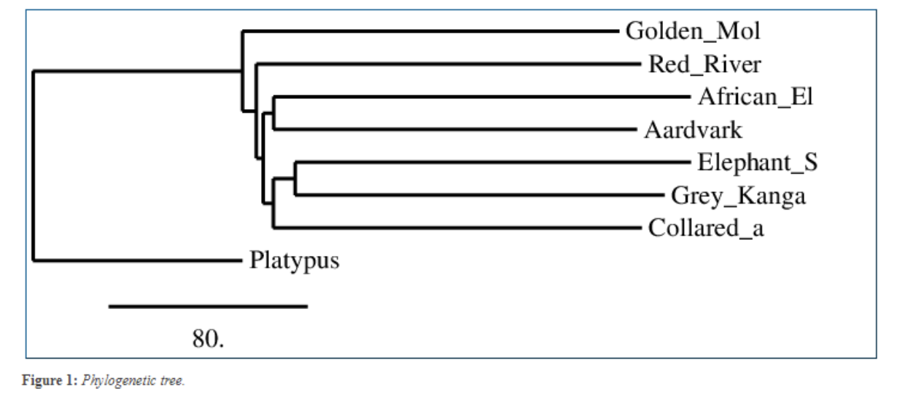
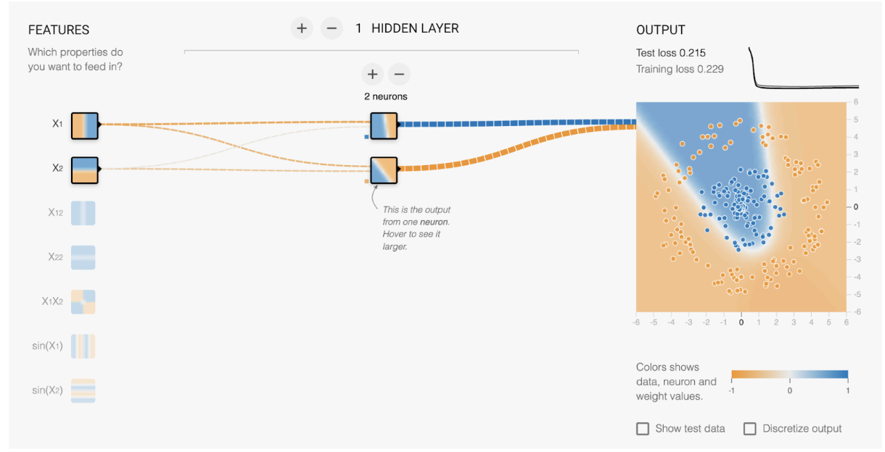
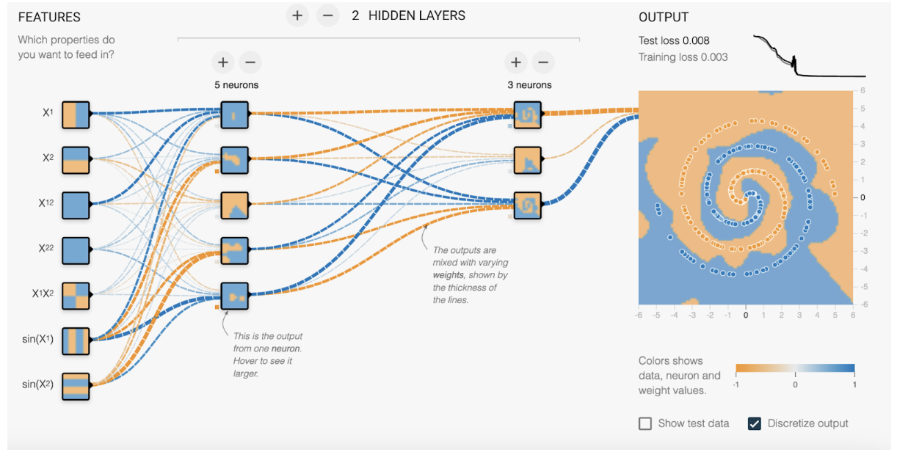
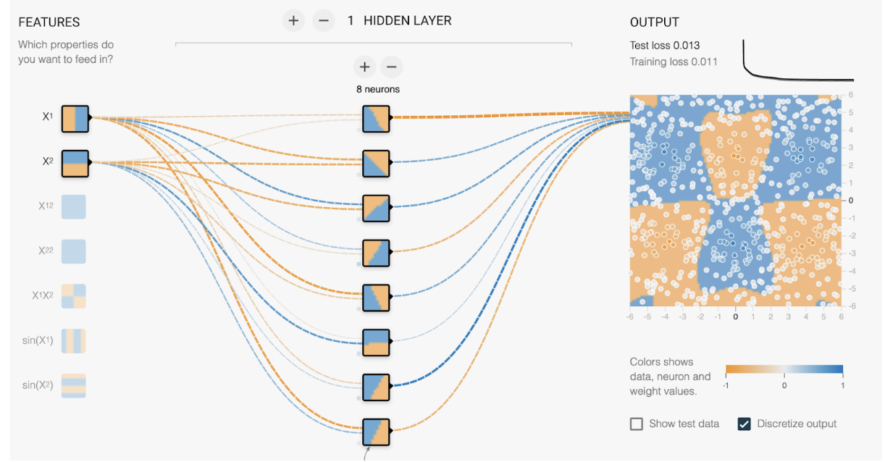
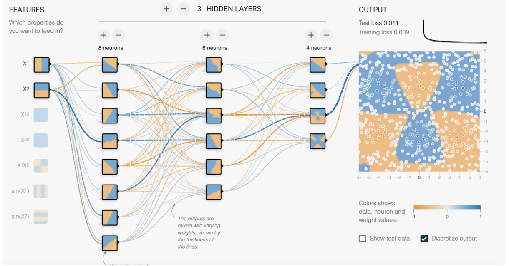

# TA notes for web exercises

## GWAS

Presentation: https://docs.google.com/presentation/d/1jBpBfO7_RGzxD1iHuN0LW8NIQqjthGYacxKAuTszbQI/edit#slide=id.p

## CCR5

Presentation: https://docs.google.com/presentation/d/1u6hFulg0Jk5Lrrx28qhOJX1ZJ4eaT8l17LBIHs6MwWI/edit#slide=id.g298136c1e23_0_0

### Alignment exercises:

1.1 Affine gaps are used, Score matrix is DNAfull, end gaps are used.

1.2: 3629 bases align, 0 are mutated, 32 are indels.

1.3: A singular 32-base deletion.

1.4: Gap open is 10, gap extend is 0.5. If we set them to 100 and 10, nothing happens. The alignment is the same.

### Translation exercises:

2.1: 5’-3’ means forwards, 3’-5’ means backwards, and 1, 2, and 3 means from the start, frameshifted 1 forwards, or 2 forwards, respectively.

2.2: 5’-3’ frame 1 is the correct reading frame (it runs from the start codon at the start to the stop codon at the end).

2.3: The consequence is a frameshift and a premature stop codon. This makes sense, as 32 / 3 is not a whole number, so there is a frameshift.

2.4: the first segment aligns, but afterwards almost nothing aligns.

### Blast exercises:

3.1: Blastn uses shorter kmers and lower thresholds to be able to find more distant matches.

3.2: The E.value refers to the expected amount of matches of similar quality given the size of the search database. The bases differ at 25 positions, and there are 0 gaps. The mutation has arisen since the last common ancestor.

3.3: A 24 basepair deletion. Delta means deletion.

3.4: It only deletes amino acids, no frameshift is observed. There are also 2 other amino acid changes. The deletion is around amino acid 150.

3.5: The findings corrosponds to our observations. We can observe the mutation is in transmembrane domain 4. The paper says that, although the mutation is not a frameshift, the protein ends up not being expressed on the cell surface.

## MRSA

Presentation: https://docs.google.com/presentation/d/1Sxbzewzm8RaVhwb8F547iwrPi3xdIsItogt7VGG0M5o/edit#slide=id.p

BLAST works by breaking the query sequence into smaller segments and finding matches in the database. It then expands these matches to find alignments.

1a: 
mecA reference genome from https://www.ncbi.nlm.nih.gov/nuccore/KC243783.1

1b: 
Title field states: MecA gene sequence analysis of methicillin resistant Staphylococcus aureus (MRSA) hospital isolate from Tamil Nadu

Here are the main sequences needed:

1c:

Nucleotide sequence

```
>KC243783.1 Staphylococcus aureus strain TN/CN/1/12 MecA (mecA) gene, complete cds
ATGAAAAAGATAAAAATTGTTCCACTTATTTTAATAGTTGTAGTTGTCGGGTTTGGTATATATTTTTATG
CTTCAAAAGATAAAGAAATTAATAATACTATTGATGCAATTGAAGATAAAAATTTCAAACAAGTTTATAA
AGATAGCAGTTATATTTCTAAAAGCGATAATGGTGAAGTAGAAATGACTGAACGTCCGATAAAAATATAT
AATAGTTTAGGCGTTAAAGATATAAACATTCAGGATCGTAAAATAAAAAAAGTATCTAAAAATAAAAAAC
GAGTAGATGCTCAATATAAAATTAAAACAAACTACGGTAACATTGATCGCAACGTTCAATTTAATTTTGT
TAAAGAAGATGGTATGTGGAAGTTAGATTGGGATCATAGCGTCATTATTCCAGGAATGCAGAAAGACCAA
AGCATACATATTGAAAATTTAAAATCAGAACGTGGTAAAATTTTAGACCGAAACAATGTGGAATTGGCCA
ATACAGGAACAGCATATGAGATAGGCATCGTTCCAAAGAATGTATCTAAAAAAGATTATAAAGCAATCGC
TAAAGAACTAAGTATTTCTGAAGACTATATCAAACAACAAATGGATCAAAATTGGGTACAAGATGATACC
TTCGTTCCACTTAAAACCGTTAAAAAAATGGATGAATATTTAAGTGATTTCGCAAAAAAATTTCATCTTA
CAACTAATGAAACAAAAAGTCGTAACTATCCTCTAGAAAAAGCGACTTCACATCTATTAGGTTATGTTGG
TCCCATTAACTCTGAAGAATTAAAACAAAAAGAATATAAAGGCTATAAAGATGATGCAGTTATTGGTAAA
AAGGGACTCGAAAAACTTTACGATAAAAAGCTCCAACATGAAGATGGCTATCGTGTCACAATCGTTGACG
ATAATAGCAATACAATCGCACATACATTAATAGAGAAAAAGAAAAAAGATGGCAAAGATATTCAACTAAC
TATTGATGCTAAAGTTCAAAAGAGTATTTATAACAACATGAAAAATGATTATGGCTCAGGTACTGCTATC
CACCCTCAAACAGGTGAATTATTAGCACTTGTAAGCACACCTTCATATGACGTCTATCCATTTATGTATG
GCATGAGTAACGAAGAATATAATAAATTAACCGAAGATAAAAAAGAACCTCTGCTCAACAAGTTCCAGAT
TACAACTTCACCAGGTTCAACTCAAAAAATATTAACAGCAATGATTGGGTTAAATAACAAAACATTAGAC
GATAAAACAAGTTATAAAATCGATGGTAAAGGTTGGCAAAAAGATAAATCTTGGGGTGGTTACAACGTTA
CAAGATATGAAGTGGTAAATGGTAATATCGACTTAAAACAAGCAATAGAATCATCAGATAACATTTTCTT
TGCTAGAGTAGCACTCGAATTAGGCAGTAAGAAATTTGAAAAAGGCATGAAAAAACTAGGTGTTGGTGAA
GATATACCAAGTGATTATCCATTTTATAATGCTCAAATTTCAAACAAAAATTTAGATAATGAAATATTAT
TAGCTGATTCAGGTTACGGACAAGGTGAAATACTGATTAACCCAGTACAGATCCTTTCAATCTATAGCGC
ATTAGAAAATAATGGCAATATTAACGCACCTCACTTATTAAAAGACACGAAAAACAAAGTTTGGAAGAAA
AATATTATTTCCAAAGAAAATATCAATCTATTAACTGATGGTATGCAACAAGTCGTAAATAAAACACATA
AAGAAGATATTTATAGATCTTATGCAAACTTAATTGGCAAATCCGGTACTGCAGAACTCAAAATGAAACA
AGGAGAAACTGGCAGACAAATTGGGTGGTTTATATCATATGATAAAGATAATCCAAACATGATGATGGCT
ATTAATGTTAAAGATGTACAAGATAAAGGAATGGCTAGCTACAATGCCAAAATCTCAGGTAAAGTGTATG
ATGAGCTATATGAGAACGGTAATAAAAAATACGATATAGATGAATAACAAAACAGTGAAGCAATCCGTAA
CGATGGTTGCTTCACTGTTTTATTATGAATTATTAATAAGTGCTGTTACTTCTCCCTTAAATACAATTTC
TTCATTTTCATTGTATGTTGAAAGTGACA
```

1d:

Protein sequence

```
>AGC51118.1 MecA [Staphylococcus aureus]
MKKIKIVPLILIVVVVGFGIYFYASKDKEINNTIDAIEDKNFKQVYKDSSYISKSDNGEVEMTERPIKIY
NSLGVKDINIQDRKIKKVSKNKKRVDAQYKIKTNYGNIDRNVQFNFVKEDGMWKLDWDHSVIIPGMQKDQ
SIHIENLKSERGKILDRNNVELANTGTAYEIGIVPKNVSKKDYKAIAKELSISEDYIKQQMDQNWVQDDT
FVPLKTVKKMDEYLSDFAKKFHLTTNETKSRNYPLEKATSHLLGYVGPINSEELKQKEYKGYKDDAVIGK
KGLEKLYDKKLQHEDGYRVTIVDDNSNTIAHTLIEKKKKDGKDIQLTIDAKVQKSIYNNMKNDYGSGTAI
HPQTGELLALVSTPSYDVYPFMYGMSNEEYNKLTEDKKEPLLNKFQITTSPGSTQKILTAMIGLNNKTLD
DKTSYKIDGKGWQKDKSWGGYNVTRYEVVNGNIDLKQAIESSDNIFFARVALELGSKKFEKGMKKLGVGE
DIPSDYPFYNAQISNKNLDNEILLADSGYGQGEILINPVQILSIYSALENNGNINAPHLLKDTKNKVWKK
NIISKENINLLTDGMQQVVNKTHKEDIYRSYANLIGKSGTAELKMKQGETGRQIGWFISYDKDNPNMMMA
INVKDVQDKGMASYNAKISGKVYDELYENGNKKYDIDE
```
 

2.b
The following organisms give hits in the initial blasting:


 
2.c.i
- You get more results and higher diversity in found organisms, including some that could be much more different to MRSA
- You get results with lower E-value but which may be of relevance when determining the origins of the MecA gene.
 
2.c.ii
The taxonomy lists the matches per organism. It gives a better overview than the “Descriptions” page.
 
2.c.iii
The graphical summary shows that most of the matches match completely while some only overlap partially.
 
 

 (I used 500 max matches)
 
 
2.d.i
This depends on their experimentation. The idea is for them to look through the different panes (graphical, taxonomy, etc.). Depending on settings, the difference may be little.
 
2.d.ii
The (?) help box on the site mentions the following:
- Megablast is intended for comparing a query to closely related sequences and works best if the target percent identity is 95% or more but is very fast.
- Discontiguous megablast uses an initial seed that ignores some bases (allowing mismatches) and is intended for cross-species comparisons.
- BlastN is slow, but allows a word-size down to seven bases.

2.e.i
The protein matches with multiple Mammaliicoccus strains and even a hypothetical salmonella protein. It could mean that horizontal gene transfer between different bacteria genera happened. Note that Mammaliicoccus is a genus of bacteria that was previously classified within the Staphylococcus genus, so they are closely related. Also, these databases can have wrongly labeled information etc., so the salmonella match may not be relevant.
 
On the risk of HGT between very different genera, chatGPT says:

The mecA gene in MRSA is located on a mobile genetic element called the staphylococcal cassette chromosome mec (SCCmec). This element has been primarily identified in staphylococci. Whether this gene can transfer to other bacterial genera, such as Salmonella, depends on several factors:
- Presence of Mobile Genetic Elements: The mecA gene would need to be on a mobile genetic element that's compatible with the recipient bacteria's machinery. While SCCmec has so far been primarily found in Staphylococcus species, the potential for its transfer to other genera is not zero, but likely low.
- Ecological Overlap: For HGT to occur, the donor and recipient bacteria often need to inhabit the same or overlapping environments. Bacteria in the human gut, for instance, have more opportunities for gene exchange than bacteria from disparate habitats.
- Cellular Barriers: Different bacterial genera might have barriers that prevent the uptake of foreign DNA. Gram-negative bacteria, for example, have an outer membrane that can act as a barrier to DNA uptake.
- Selective Pressure: Even if the gene is transferred, it needs to confer a survival advantage for it to be maintained in the population. For example, in the presence of methicillin or other beta-lactams, a bacterium with the mecA gene would have a survival advantage.
  
To date, there's no documented evidence of the mecA gene transferring from Staphylococcus to genera like Salmonella. However, other resistance genes have been documented to jump between genera. For instance, resistance genes carried on plasmids, such as extended-spectrum beta-lactamase (ESBL) genes, have been found in various Enterobacteriaceae, including E. coli and Klebsiella.
If such a transfer were to occur, especially to a pathogen with a different route of infection or resistance to other drugs, it could pose a significant public health concern. It's essential to continue monitoring and researching antibiotic resistance to identify and respond to new threats as they emerge.
 
2.f
It probably does suggest HGT is very likely between the Staphylococcus strains. But it doesn’t tell us the order of the transferring. We’re just seeing a snapshot of the “current” state.
 
2.g.i
They should see Staphylococcus epidermidis in their results, implying it could be true.
 
2.g.ii
We cannot conclude from one patient getting it from S. epidermidis that it always comes from there.

3.a 
Nucleotide sequences for MecA i andre bakterier (her bare 3, men de skal helst vælge flere):

```
>Staphylococcus-epidermidis
ATGAAAAAGATAAAAATTGTTCCACTTATTTTAATAGTTGTAGTTGTCGGGTTTGGTATATATTTTTATG
CTTCAAAAGATAAAGAAATTAATAATACTATTGATGCAATTGAAGATAAAAATTTCAAACAAGTTTATAA
AGATAGCAGTTATATTTCTAAAAGCGATAATGGTGAAGTAGAAATGACTGAACGTCCGATAAAAATATAT
AATAGTTTAGGCGTTAAAGATATAAACATTCAGGATCGTAAAATAAAAAAAGTATCTAAAAATAAAAAAC
GAGTAGATGCTCAATATAAAATTAAAACAAACTACGGTAACATTGATCGCAACGTTCAATTTAATTTTGT
TAAAGAAGATGGTATGTGGAAGTTAGATTGGGATCATAGCGTCATTATTCCAGGAATGCAGAAAGACCAA
AGCATACATATTGAAAATTTAAAATCAGAACGTGGTAAAATTTTAGACCGAAACAATGTGGAATTGGCCA
ATACAGGAACAGCATATGAGATAGGCATCGTTCCAAAGAATGTATCTAAAAAAGATTATAAAGCAATCGC
TAAAGAACTAAGTATTTCTGAAGACTATATCAAACAACAAATGGATCAAAAGTGGGTACAAGATGATACC
TTCGTTCCACTTAAAACCGTTAAAAAAATGGATGAATATTTAAGTGATTTCGCAAAAAAATTTCATCTTA
CAACTAATGAAACAGAAAGTCGTAACTATCCTCTAGGAAAAGCGACTTCACATCTATTAGGTTATGTTGG
TCCCATTAACTCTGAAGAATTAAAACAAAAAGAATATAAAGGCTATAAAGATGATGCAGTTATTGGTAAA
AAGGGACTCGAAAAACTTTACGATAAAAAGCTCCAACATGAAGATGGCTATCGTGTCACAATCGTTGACG
ATAATAGCAATACAATCGCACATACATTAATAGAGAAAAAGAAAAAAGATGGCAAAGATATTCAACTAAC
TATTGATGCTAAAGTTCAAAAGAGTATTTATAACAACATGAAAAATGATTATGGCTCAGGTACTGCTATC
CACCCTCAAACAGGTGAATTATTAGCACTTGTAAGCACACCTTCATATGACGTCTATCCATTTATGTATG
GCATGAGTAACGAAGAATATAATAAATTAACCGAAGATAAAAAAGAACCTCTGCTCAACAAGTTCCAGAT
TACAACTTCACCAGGTTCAACTCAAAAAATATTAACAGCAATGATTGGGTTAAATAACAAAACATTAGAC
GATAAAACAAGTTATAAAATCGATGGTAAAGGTTGGCAAAAAGATAAATCTTGGGGTGGTTACAACGTTA
CAAGATATGAAGTGGTAAATGGTAATATCGACTTAAAACAAGCAATAGAATCATCAGATAACATTTTCTT
TGCTAGAGTAGCACTCGAATTAGGCAGTAAGAAATTTGAAAAAGGCATGAAAAAACTAGGTGTTGGTGAA
GATATACCAAGTGATTATCCATTTTATAATGCTCAAATTTCAAACAAAAATTTAGATAATGAAATATTAT
TAGCTGATTCAGGTTACGGACAAGGTGAAATACTGATTAACCCAGTACAGATCCTTTCAATCTATAGCGC
ATTAGAAAATAATGGCAATATTAACGCACCTCACTTATTAAAAGACACGAAAAACAAAGTTTGGAAGAAA
AATATTATTTCCAAAGAAAATATCAATCTATTAACTGATGGTATGCAACAAGTCGTAAATAAAACACATA
AAGAAGATATTTATAGATCTTATGCAAACTTAATTGGCAAATCCGGTACTGCAGAACTCAAAATGAAACA
AGGAGAAACTGGCAGACAAATTGGGTGGTTTATATCATATGATAAAGATAATCCAAACATGATGATGGCT
ATTAATGTTAAAGATGTACAAGATAAAGGAATGGCTAGCTACAATGCCAAAATCTCAGGTAAAGTGTATG
ATGAGCTATATGAGAACGGTAATAAAAAATACGATATAGATGAATAACAAAACAGTGAAGCAATCCGTAA
CGATGGTTGCTTCACTGTTTTATTATGAATTATTAATAAGTGCTGTTACTTCTCCCTTAAATACAATTTC
TTCATTTTCATTGT
```

```
>Staphylococcus-Capitis
ATGAAAAAGATAAAAATTGTTCCACTTATTTTAATAGTTGTAGTTGTCGGGTTTGGTATATATTTTTATG
CTTCAAAAGATAAAGAAATTAATAATACTATTGATGCAATTGAAGATAAAAATTTCAAACAAGTTTATAA
AGATAGCAGTTATATTTCTAAAAGCGATAATGGTGAAGTAGAAATGACTGAACGTCCGATAAAAATATAT
AAAAGTTTAGGCGTTAAAGATATAAACATTCAGGATCGTAAAATAAAAAAAGTATCTAAAAATAAAAAAC
GAGTAGATGCTCAATATAAAATTAAAACAAACTACGGTAACATTGATCGCAACGTTCAATTTAATTTTGT
TAAAGAAGATGGTATGTGGAAGTTAGATTGGAATCATAGCGTCATTATTCCAGGAATGCAGAAAGACCAA
AGCATACATATTGAAAATTTAAAATCAGAACGTGGTAAAATTTTAGACCGAAACAATGTGGAATTGGCCA
ATACAGGAACAGCATATGAGATAGGCATCGTTCCAAAGAATGTATCTAAAAAAGATTATAAAGCAATCGC
TAAAGAACTAAGTATTTCTGAAGACTATATCAAACAACAAATGGATCAAAATTGGGTACAAGATGATACC
TTCGTTCCACTTAAAACCGTTAAAAAAATGGATGAAGATTTAAGTGATTTCGCAAAAAAATTTCATCTTA
CAACTAATGAAACAGAAAGTCGTAACTATCCTCTAGAAAAAGCGACTTCACATCTATTAGGTTATGTTGG
TCCCATTAACTCTGAAGAATTAAAACAAAAAGAATATAAAGGCTATAAAGATGATGCAGTTATTGGTAAA
AAGGGACTCGAAAAACTTTACGATAAAAAGCTCCAACATGAAGATGGCTATCGTGTCACAATCGTTGACG
ATAATAGCAATACAATCGCACATACATTAATAGAGAAAAAGAAAAAAGATGGCAAAGATATTCAACTAAC
TATTGATGCTAAAGTTCAAAAGAGTATTTATAACAACATGAAAAATGATTATGGCTCAGGTACTGCTATC
CACCCTCAAACAGGTGAATTATTAGCACTTGTAAGCACACCTTCATATGACGTCTATCCATTTATGTATG
GCATGAGTAACGAAGAATATAATAAATTAACCGAAGATAAAAAAGAACCTCTGCTCAACAAGTTCCAGAT
TACAACTTCACCAGGTTCAACTCAAAAAATATTAACAGCAATGATTGGGTTAAATAACAAAACATTAGAC
GATAAAACAAGTTATAAAATCGATGGTAAAGGTTGGCAAAAAGATAAATCTTGGGGTGGTTACAACGTTA
CAAGATATGAAGTGGTAAATGGTAATATCGACTTAAAACAAGCAATAGAATCATCAGATAACATTTTCTT
TGCTAGAGTAGCACTCGAATTAGGCAGTAAGAAATTTGAAAAAGGCATGAAAAAACTAGGTGTTGGTGAA
GATATACCAAGTGATTATCCATTTTATAATGCTCAAATTTCAAACAAAAATTTAGATAATGAAATATTAT
TAGCTGATTCAGGTTACGGACAAGGTGAAATACTGATTAACCCAGTACAGATCCTTTCAATCTATAGCGC
ATTAGAAAATAATGGCAATATTAACGCACCTCACTTATTAAAAGACACGAAAAACAAAGTTTGGAAGAAA
AATATTATTTCCAAAGAAAATATAAATCTATTAACTGATGGTATGCAACAAGTCGTAAATAAAACACATA
AAGAAGATATTTATAGATCTTATGCAAACTTAATTGGCAAATCCGGTACTGCAGAACTCAAAATGAAACA
AGGAGAAACTGGCAGACAAATTGGGTGGTTTATATCATATGATAAAGATAATCCAAACATGATGATGGCT
ATTAATGTTAAAGATGTACAAGATAAAGGAATGGCTAGCTACAATGCCAAAATCTCAGGTAAAGTGTATG
ATGAGCTATATGAGAACGGTAATAAAAAATACGATATAGATGAATAA
```

```
Staphylococcus-hominis
>JF710613.1 UNVERIFIED: Staphylococcus hominis strain 4053 penicillin binding protein-like (mecA) gene, partial sequence
AGTTGTAGTTGTCGGGTTTGGTATATATTTTTATGCTTCAAAAGATAAAGAAATTAATAATACTATTGAT
GCAATTGAAGATAAAAATTTCAAACAAGTTTATAAAGATAGCAGTTATATTTCTAAAAGCGATAATGGTG
AAGTAGAAATGACTGAACGTCCGATAAAAATATATAATAGTTTAGGCGTTAAAGATATAAACATTCAGGA
TCGTAAAATAAAAAAAGTATCTAAAAATAAAAAACGAGTAGATGCTCAATATAAAATTAAAACAAACTAC
GGTAACATTGATCGCAACGTTCAATTTAATTTTGTTAAAGAAGATGGTATGTGGAAGTTAGATTGGGATC
ATAGCGTCATTATTCCAGGAATGCAGAAAGACCAAAGCATACATATTGAAAATTTAAAATCAGAACGTGG
TAAAATTTTAGACCGAAACAATGTGGAATTGGCCAATACAGGAACAGCATATGAGATAGGCATCGTTCCA
AAGAATGTATCTAAAAAAGATTATAAAGCAATCGCTAAAGAACTAAGTATTTCTGAAGACTATATCAAAC
AACAAATGGATCAAAATTGGGTACAAGATGATACCTTCGTTCCACTTAAAACCGTTAAAAAAATGGATGA
ATATTTAAGAGATTTCGCAAAAAAATTTCATCTTACAACTAATGAAACAGAAAGTCGTAACTATCCTCTA
GGAAAAGCGACTTCACATCTATTAGGTTATGTTGGTCCCATTAACTCTGAAGAATTAAAACAAAAAGAAT
ATAAAGGCTATAAAGATGATGCAGTTATTGGTAAAAAGGGACTCGAAAAACTTTACGATAAAAAGCTCCA
ACATGAAGATGGCTATCGTGTCACAATCGTTAGAGTCGACGATAATAGCAATACAATCGCACATACATTA
ATAGAGAAAAAGAAAAAAGATGGCAAAGATATTCAACTAACTATTGATGCTAAAGTTCAAAAGAGTATTT
ATAACAACATGAAAAATGATTATGGCTCAGGTACTGCTATCCACCCTCAAACAGGTGAATTATTAGCACT
TGTAAGCACACCTTCATATGACGTCTATCCATTTATGTATGGCATGAGTAACGAAGAATATAATAAATTA
ACCGAAGATAAAAAAGAACCTCTGCTCAACAAGTTCCAGATTACAACTTCACCAGGTTCAACTCAAAAAA
TATTAACAGCAATGATTGGGTTAAATAACAAAACATTAGACGATAAAACAAGTTATAAAATCGATGGTAA
AGGTTGGCAAAAAGATAAATCTTGGGGTGGTTACAACGTTACAAGATATGAAGTGGTAAATGGTAATATC
GACTTAAAACAAGCAATAGAATCATCAGATAACATTTTCTTTGCTAGAGTAGCACTCGAATTAGGCAGTA
AGAAATTTGAAAAAGGCATGAAAAAACTAGGTGTTGGTGAAGATATACCAAGTGATTATCCATTTTATAA
TGCTCAAATTTCAAACAAAAATTTAGATAAGAAATATGATTTGCTGATTCAGGTTACGGACAAGGTGAAA
TACTGATTAACCCAGTACAGATCCTTTCAATCTATAGCGCATTAGAAAATAATGGCAATATTAACGCACC
TCACTTATTAAAAGACACGAAAAACAAAGTTTGGAAGAAAAATATTATTTCCAAAGAAAATATCAATCTA
TTAACTGATGGTATGCAACAAGTCGTAAATAAAACACATAAAGAAGATATTTATAGATCTTATGCAAACT
TAATTGGCAAATCCGGTACTGCAGAACTCAAAATGAAACAAGGAGAAACTGGCAGACAAATTGGGTGGTT
TATATCATATGATAAAGATAATCCAAACATGATGATGGCTATTAATGTTAAAGATGTACAAGATAAAGGA
ATGGCTAGCTACAATGCCAAAATCTCAGGTAAAGTGTATGATGAGCTATATGAGAACGGTAATAAAAAAT
ACGATATAGATGAATAACAAAACAGTGAAGCAATCCGTAACGATGGTTGCTTCACTGTTTTATTATGAAT
TATTAATAAGTGCTGTTACTTCTCCCTTAAATACAATTTCTTCATTTTCATTGTATGTTGAAAGTGACAC
TGTAACGAGTCCATTTTCTTTTTTTATGGATTTCTTATTTGTAATTTCAGCGATAACGTACAATGTATTA
CCTGGGTATACAGGTTTAATAAA
```

3.d.i
We get aligned sequences between the strains.
 
3.d.ii
It may show us specific variations between strains that make it more or less probable that the HGT happened between those strains. E.g. if two strains have the same single nucleotide variation that the others do not have.
 
3.e
The answers depend on the chosen strains. But the phylograms can indicate which strains the HGT most likely happened between.


4.a
This is still difficult to answer. But we see a lot of matches with other Staphylococcus strains, like S. epidermis. And there may have been some HGT to Mammaliicoccus since we see a good number of matches with those as well. Also, the HGT is likely continually happening between the strains.
 
4.b+ The rest of the questions are open-ended questions that should get them thinking.


## Aardvarg

Presentation: https://docs.google.com/presentation/d/1pwiRdDBazXl35KePMS5PktpzccUuEMGR/edit#slide=id.p1


::: {.content-hidden unless-profile="ta"}
::: {.callout-note appearance="simple" collapse="true"}
## TA note

A completed curated multiple alignment is attaches as TA_aligned_cured.phy

A folder with the completed newick trees is attached as TA_newick

A completed fasta file with added extra elephants is attached



Below are the answers to the questions in order.  I have added pictures where I find it suitable.




BioNJ_Hamming.txt:

```txt
((Golden_Mol:155.673782,Red_River:154.326218):4.257894,(Aardvark:145.141327,
African_El:168.858673):3.390268,(Collared_a:147.386536,(Grey_Kanga:146.800003,
Elephant_S:161.199997):9.631905):4.711679);
```

BioNJ_Jukes_Cantor.txt:

```txt
((Golden_Mol:0.118188,Red_River:0.116918):0.003841,(Aardvark:0.108637,
African_El:0.130041):0.003100,(Collared_a:0.110687,(Grey_Kanga:0.110186,
Elephant_S:0.123141):0.008748):0.004254);
```

BioNJ_Kimura.txt:

```txt
((Golden_Mol:0.123113,Red_River:0.120247):0.004572,(Aardvark:0.111798,
African_El:0.134623):0.002983,(Collared_a:0.115352,(Grey_Kanga:0.114640,
Elephant_S:0.128854):0.008608):0.004993);
```

PhyML_GTR.txt:

```txt
((((African_El:0.628600,Red_River:0.559674)0.165000:0.069529,(Aardvark:0.326772,
Golden_Mol:0.586933)0.149000:0.076902)0.760000:0.077234,Elephant_S:0.727699)
0.351000:0.085600,Grey_Kanga:0.537334,Collared_a:0.446054);
```

PhyML_HKY85.txt:

```txt
((((Golden_Mol:1.770432,Red_River:1.213225)0.239000:0.320206,(Aardvark:0.920700,
African_El:2.021196)0.681000:0.188120)0.619000:0.196596,Elephant_S:1.897230)
0.022000:0.329309,Grey_Kanga:1.105003,Collared_a:1.279808);
```
:::
:::


- A completed version of the animals.fasta file is attached as TA_animals.fasta. The students will be given a fasta-file containing only headers. They need to fill out the sequences themselves. 
- A completed curated multiple alignment is attaches as TA_aligned_cured.phy
- A folder with the completed newick trees is attached as TA_newick
- A completed fasta file with added extra elephants is attached as TA_animals_with_elephants.fasta
- Below are the answers to the questions in order.  I have added pictures where I find it suitable.

What does Flip do? 
- Flip an entire tree at a node (see animation on the button)

What does Swap do?
- Flip two branches at a node (see animation on the button)

What does Reroot do? 

- Picks an outgroup and reorders the tree accordingly

Click on “Reset (cancel all changes)” in the section “Select an action”. Done How many terminal nodes (leafs) and how many internal nodes are there in the tree? 

- Leafs: 8 	
- Internal nodes:7 


Which node represents the most recent common ancestor between the Aardvark and the African Elephant? What about the Elephant Shrew? 

- Elephant: Node with pink arrow
- Elephant shrew: node with green arrow  
- 

Which of the reference animals are closest related to the Aardvark according to this model?

- African Elephant

Does the tree look like you expected? Surprised that the elephant is the closest relative, maybe.

Go read the introduction in the Gblocks documentation. What kind of positions are NOT included after curation? 

- “The selected blocks must fulfill certain requirements with respect to the lack of large segments of contiguous nonconserved positions, lack or low density of gap positions and high conservation of flanking positions, making the final alignment more suitable for phylogenetic analysis”
  
Try out the two DNA/RNA substitution models for PhyML (HKY58 and GTR). Remember to save your tree by clicking “Tree in newick format” and save the file. These tree-files can be visualised by using the programme “TreeDyn” under the top tab “Online Programmes”.

- See newick files in the folder “TA_newick”

Do the trees formed by GTR and HKY85 look alike?

- No

**HKY58**


**GTR**


What are the Aardvarks closest relatives according to the two trees?

- HKY85: African Elephant
- GTR: Golden Mole

Try out the three DNA/RNA substitution models for BioNJ (kimura, jukes-cantor, hamming ) Remember to save your trees. 

See newick files in the folder “TA_newick”

Do these three trees look alike? No, the observant student might notice that in the newick files, the distances differ, even though they give similar looking trees.

**Kimura**




**Jukes-Cantor**


**Hamming**


Do they look like the trees formed by PhyML?

- No.
- 
What are the Aardvarks closest relatives according to the three trees?

- African Elephant

Food for thought exercise: With more elephants -> one-click analysis

- The elephants are very close compared to all the other animals, making it difficult to actually see the relations among themselves. This might open up for a discussion about the scope of analysis being determined by how closely related all the reference animals are. 

End note exercise

Wikipedia says the closest relative is the elephant shrew, but none of our analysis shows this. Other websites agree that elephants are the closest relative. So this is a quick note on “kildekritik”


##  Unsupervised Learning

Notes for your fellow TAs (answers to questions etc)

- Continuity of the two circles is most important - they should not “jump” at any point, but be in a circle or figure of eight.
- The most important part here is distinguishing between the two global structures, so a high n_neighbors is important, while it seems slightly better with a low min_dist.
- The circles intertwining is an important part of the 3D structure and should be represented. On the other hand, locally, the points in each circle are always closer to points in the circle, so the expectation might be that we want something similar to 1.
- 15 neighbors and 0.05 min_dist recapture the circles best (in my opinion), but it is not stable, and most other settings make the two circles independent. Higher n_neighbors are otherwise better, as they capture the circularity, unlike low n_neighbors.
- It is a gradual process, but it begins looking like a skeleton at 50 neighbors in my opinion, but with hints at 20 and definitely at 100.
- 0.1 or 0.25 seems best, as there is some volume and global structure which it captures, without it being too stretched out.
- The legs, especially the front legs are detached fully. The spine/ribcage is prioritized as it has more points.
- The trefoil is mostly represented as a line or figure of eight, both of which are bad representations.
- It does. Adjusting min_dist is not needed, but does change how squiggly the lines are, but not that much else.

### Exercise text

Introduction: Unsupervised Learning

Today, the focus will be on unsupervised learning, and a specific implementation called UMAP. Many types of unsupervised learning, including PCA and UMAP, have a primary objective of performing dimensionality reduction. That is, you start with many dimensions, and you want to attain a lower-dimension output which best depicts the higher dimensionality relationship. In the simplest case, it could depict a 3D object as a 2D figure, but it can also be extended to many more dimensions.

Unsupervised learning and dimensionality reduction are also essential for other types of machine learning, as model training can be computationally expensive, and reduction of input size while losing as little information as possible therefore can be important to make a model effective without overfitting or being too slow.

At the other extreme, you also sometimes would like to represent the relationship between variants in genetic data. Here dimensionality reduction can also be effective in reducing the number of dimensions, often being able to depict the important differences between the samples in a couple of dimensions, even though the input has millions of dimensions (1 dimension per variant). For example, a PCA based on a wide sampling of Europeans recaptured the geography based on the segregating variants.

PCA is one of the simplest approaches to dimensionality reduction and consists of finding a vector which describes the most possible variation (the first principal component, which is in practice a regression across all dimensions) and repeating this, each time adding the constraint that the vector must be independent of the previous vectors. In the end, you will have an ordered list of dimensions, with the first dimension describing the most variation and the last describing the least.

PCA has a couple of negatives - it weighs everything based on its deviation from the mean, which means extreme points are very important for deciding the principal components. Secondly, each dimension is a linear transformation, meaning that non-linear relationships in the data are not modelled.

UMAP tries to handle both of these problems, with two hyperparameters (n_neighbors and min_dist), which allows it to weigh close-by points more strongly when performing the dimensionality reduction. Therefore, it has a better grasp of local structure, which PCA often loses. You will get a better understanding of these parameters during the exercise below.

Understanding Umap
Open up Understanding UMAP at the following link:

https://pair-code.github.io/understanding-umap/

Read until Figure 5, in the section UMAP Parameters. You can understand the figures later, we will work on them through the exercises. The questions will focus strongly on interpreting how to reduce multidimensional (3D or more) structures into 2D, so think about how you would represent a 3D animal in 2D, for example. The website also mentions t-SNE as a comparison multiple times, but we will not focus on how it works in this exercise.

Go back up to Figure 4, UMAP projection. Look through the various toy datasets - some are more obvious than others, but in all cases the data is in more than 2 dimensions, being either 3D or multi-D. Pick the bottom-left, “Points Arranged in 3D, on two unlinked circles”.
Consider the two circles - how would you arrange them in 2D?
Which combination(s) of n_neighbors and min_dist (hereafter called parameters), do you think best represents the circles?
Consider the other case with two circles (third row, rightmost), “Points arranged in 3D, on two linked circles”. This case is a bit more tricky, think about how you would like them to be arranged in 2D.
Which combination(s) of n_neighbors and min_dist (hereafter called parameters), do you think best represents the linked circles?

Scroll down to Figure 5, a 3D projection of a mammoth skeleton. Read the section below, and then try the different combinations of parameters in Figure 5. Try to trace the points in the 2D plot, and consider whether the global structure is recaptured well.
Set min_dist to the lowest value, and try adjusting n_neighbors. How many neighbors are needed to get something that looks like a skeleton?
Set n_neighbors to 200, and try adjusting min_dist. What value of min_dist looks best to you?
Set the settings to n_neighbors 100 and min_dist 0.25. Trace the various points, to see where they correspond to the 3D structure. Which body part(s) is it handling the worst? 

Read the rest of the sections, and focus especially on the “How to (mis)read UMAP” section. With all this knowledge, it is time to go back to the start. Scroll back to Figure 1. Pick out the “Trefoil Knot”, on the third row, second from the right. Create the UMAP projection with 200 points
Try running it with min_dist 0 and low levels of n_neighbors (3-20). What is lacking in the 2D representation?
Then run it with a high level of n_neighbors (80-100). Does it look more like a trefoil now?

 https://www.nature.com/articles/nature07331


## Long reads

Presentation: https://docs.google.com/presentation/d/1EFSuxP3f8PLj8E4-5CafL_l8RIlpkwtx5U-G_glH66w/edit#slide=id.p


## Neural networks

Example result for the first group of questions


X1 makes a vertical gradient, which means that the neurons have also made a vertical gradient, but it can still isolate the blue points by having vastly different biases. Therefore, the only real difference is the biases.

Test loss is around 0.26, not that good.

The current singular Feature is not enough to distinguish things that are not vertical, neurons/layers will not help here.

Example result after 700 generations for the second group of questions.



Yes, it is around 0.22 now.
It does not have to be vertical slices anymore, through the combination of X1 and X2 gradients it can pick any slope for each neuron.
As it can now combine two slopes by using two neurons, it works better than the previous model, but still with a lot of incorrect classification.


Only a single neuron more is needed (three total), as it can now shape a triangle-like shape with its three slopes.


Using X12 and X22 allows it to form a circle in the middle, so only a single neuron is needed.


This model has many features and neurons going for it, but it cannot distinguish between left and right nor what is the center, and therefore fails to create a good fit.



Minimal network that I could identify that fit very well with some consistency. It was run multiple times for 500 Epochs, and some of the runs did not perform well. The times it did fit well were usually after 200 Epochs, otherwise, it got stuck in a local minima.
Usually, one or more neurons in the last layer look spiral-like - in the above example, neuron 1 and 3 in the second layer has the imprint of a spiral. These are also the neurons that primarily determine the output, as neuron 2 has a much lower weight.
Even just removing one feature (such as X22) which seems to be weakly performing makes the network perform much worse.



X1 and X2 are not enough to get a Test Loss under 0.005. It gets close (around 0.01), and the Training loss is quite close to the Test, so we are not overfitting. It is already performing quite well with just eight neurons.



More layers help some but not that much. More than 2 layers are not needed either, as the neurons in layer 2 are quite similar to the neurons in layer 1, each depicting a slope.


The other features help a bit more, but all of these improvements are quite marginal. 


## ORF finding

Presentation: https://docs.google.com/presentation/d/1amhu1Wrjg_wBtKpSc6C7KZh1dqCUjwDnJlm7dVzpAhA/edit#slide=id.p

### Part 1, ORF Finder

Preamble: In general, ORFs can be found to be arbitrarily small. However, the larger the ORF is, the more strongly it indicates a true gene and significant function for it. We can use the standard genetic code, and it should work well since it is from a plasmid and therefore does not have the advanced eukaryotic features.

1.1: 98

1.2: 1095 and 78

1.3: Stop codons. This is both due to stop codons having more options, but also due to the natural selection of start codons being restrained to only places wherein expression should happen.

Example result page after restricting ORF search to 300+ nucleotides


1.4: 3. ORF13 and ORF1 slightly overlap. ORF10 and ORF18 greatly overlap. ORF11 and ORF16 slightly overlap.

1.5: + strand is most common. Only two genes are - strand, so 17 genes are + strand. The names are also ordered based on strandedness.
Part 2, Expanding the search

Table for answering question 1-3 below:
Preamble: When blasting the found ORFs, it is very good if you find a large match, but even just a very good match in part of the ORF also indicates that there is a gene present in the area of the ORF. Smartblast works well for quick answers and a good sampling of possible matches. Make sure that they note down their results in a notebook, file or table.
2.1: All 10 have related known proteins. Depending on your criteria, 2-5 have relatively bad matches, but large regions seem similar, indicating that it is a real protein product.
2.2: Many genes refer to Vancomycin resistance, which is a common antibiotic used against severe infections.
2.3: 7 out of 10 genes are implicated in antibiotic resistance. This does not mean that it is certain they confer resistance (see the transferases), but the genes on plasmid are often there for a reason, strongly indicating that this plasmid confers antibiotic resistance.
2.4: ORF13/ORF1 both have good, resistance-related hits. ORF18 seems plausible, while ORF10 has no hits. ORF16/ORF11 are not the best hits, but both seem possible.
2.5-7: It confers resistance, primarily against Vancomycin, which is a glycopeptide antibiotic used against gram-positive bacteria already resistant to other antibiotics. It is rarely used against Enterococcus nowadays, as they often are resistant.

ORF_Label
Length
Putative Function
Resistance?
ORF8
364
Vancomycin resistance histidine kinase VanS
Yes
ORF1
343
Vancomycin/teicoplanin A-type resistance protein VanA 
Yes
ORF18
337
ISL3 family transposase (only bad matches)
No
ORF13
322
Vancomycin resistance protein VanH 
Yes
ORF12
302
Aminoglycoside 6-adenylyltransferase AadK (only bad matches)
Yes
ORF11
289
Nucleotidyltransferase domain-containing protein
No
ORF17
264
Aminoglycoside O-phosphotransferase APH(3')-IIIa
Yes
ORF3
245
23S rRNA (adenine(2058)-N(6))-methyltransferase Erm(B)
Yes
ORF16
244
class I SAM-dependent methyltransferase
No
ORF7
231
Vancomycin resistance response regulator transcription factor VanR-G-Cd
Yes
ORF19
(11th hit)
228
IS6-like element ISSod8 family transposase (only bad matches)
No


## RNA folding

Presentation: https://docs.google.com/presentation/d/1EFSuxP3f8PLj8E4-5CafL_l8RIlpkwtx5U-G_glH66w/edit#slide=id.p